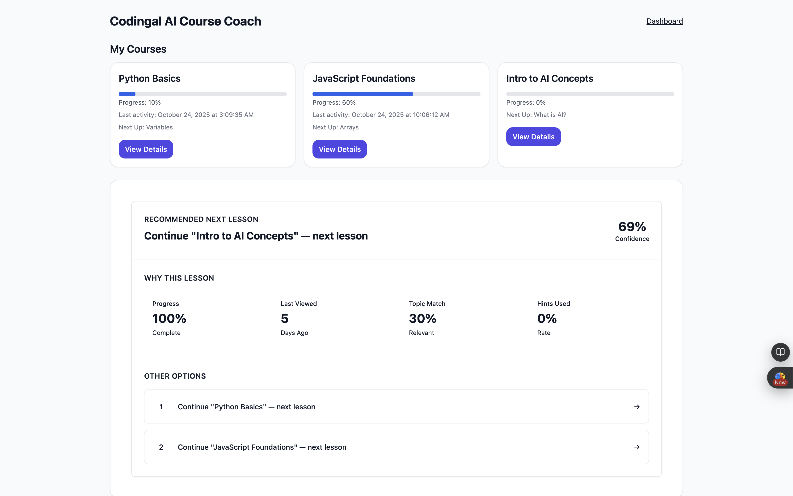
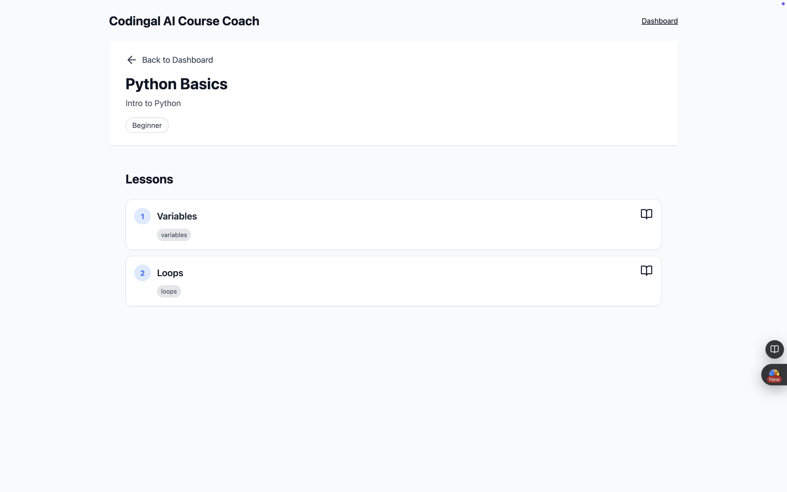
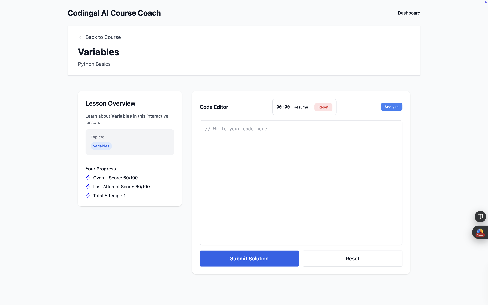
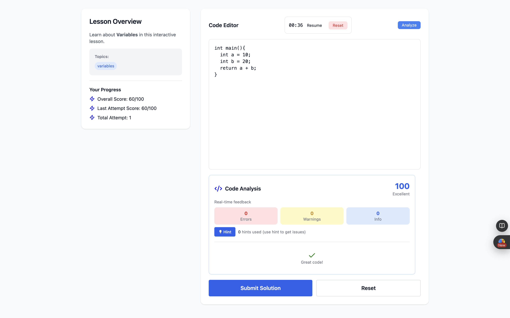
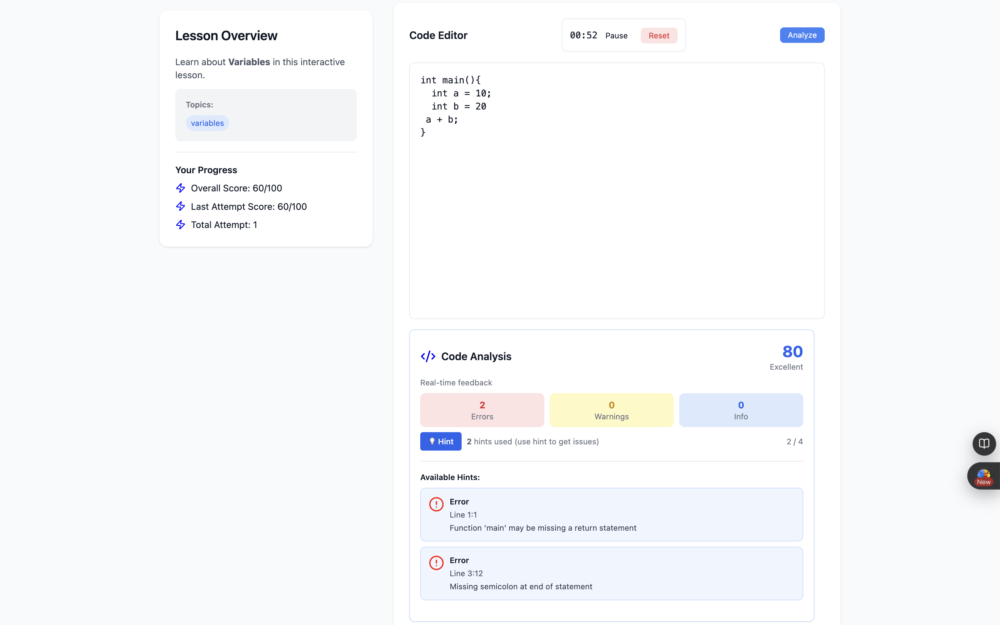

# 🚀 Codingal — AI Course Coach (Full-Stack Assignment)

### 🧑‍💻 Completed by **Md Muzzammil Rashid**

---

## 🧭 Quick Start Guide

### ⚙️ Backend Setup
```bash
cd backend
python -m venv .venv && source .venv/bin/activate
pip install -r requirements.txt
cd app
python manage.py migrate
python manage.py runserver
# Server running on: http://127.0.0.1:8000/api/
```
---

### 💻 Frontend Setup
```bash
cd frontend
npm install
npm run dev
```

Frontend runs on:  
➡️ `http://localhost:5173/` (or similar depending on your setup)

---

## 🌐 Frontend Implementation

### 🏠 1. Dashboard
**Path:** `/`

**Features:**
- Displays enrolled course cards.
- Includes an **AI Course Coach Panel** for real-time assistance.
- Fully responsive layout for all screen sizes.

**Screenshot:**  


---

### 📘 2. Course Page
**Path:** `/course/{courseId}`

**Features:**
- Shows detailed course information.
- Lists all lessons under the selected course.
- Responsive design for desktop, tablet, and mobile.

**Screenshot:**  


---

### 💡 3. Lesson Page
**Path:** `/lesson/{lessonId}`

**Features:**
1. **Code Attempt Viewer** — Users can paste and analyze their code snippets in real time.  
2. **Hint & Time Tracking** — Tracks number of hints used and time taken per attempt.  
3. Smooth UI updates without resetting hint usage.  
4. Integrated with backend APIs for live code evaluation.  

**Screenshot:**  

### Code Editor

### Issues and Hints


---

### 🔗 4. API Integration
All frontend components are integrated with the backend via RESTful APIs for seamless data flow and state management.


---
### 🔗 5. Performance Optimization
 Implemented **React Query** for intelligent caching, background refetching, and API response optimization — improving overall app performance and reducing redundant network calls.

---

## 🧩 Backend Implementation

### 📍 Core API Endpoints
| Method | Endpoint | Description |
|---------|-----------|-------------|
| `GET` | `/api/students/<id>/overview/` | Fetch student overview and progress |
| `GET` | `/api/students/<id>/recommendation/` | Retrieve AI-based course recommendations |
| `POST` | `/api/attempts/` | Record student lesson attempts |
| `POST` | `/api/analyze-code/` | Analyze code snippets using AI model |

---

### ⚡ Additional Endpoints (Frontend Feature Support)
| Method | Endpoint | Description |
|---------|-----------|-------------|
| `GET` | `/api/courses/<id>/` | Fetch course details |
| `GET` | `/api/lesson/<id>/` | Retrieve lesson details |
| `POST` | `/api/attempts/` | Log code attempts and performance metrics |

**Screenshot:**  


---

## 🧠 Tech Stack

| Layer | Technology |
|--------|-------------|
| **Frontend** | React.js, Tailwind CSS, Axios, Vite, ReactQuery, Lucide-React |
| **Backend** | Django, Django REST Framework |
| **Database** | SQLite  |
| **Version Control** | Git & GitHub |
| **Environment** | Virtualenv (Python), Node.js |

---

## 📱 Responsiveness
All pages (Dashboard, Course, and Lesson) are built with **responsive layouts** using **Tailwind CSS** ensuring a consistent user experience across devices.


---

## 🧾 Summary

✅ Complete full-stack AI Course Coach application  
✅ RESTful backend API with student tracking and code analysis  
✅ Modern responsive frontend with AI integration  
✅ Scalable and maintainable project structure  
